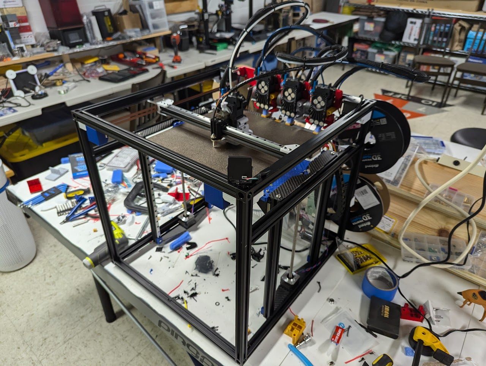
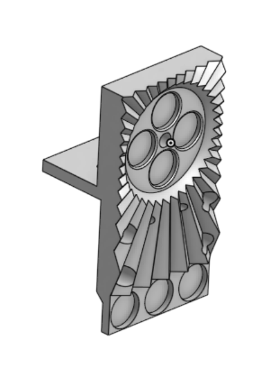
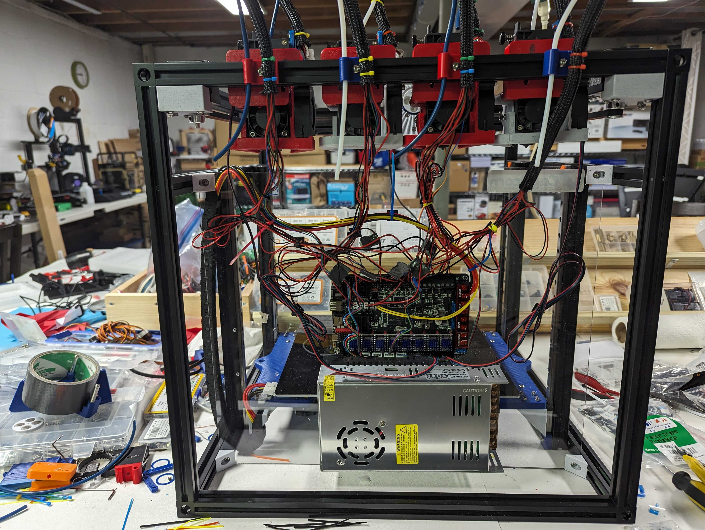
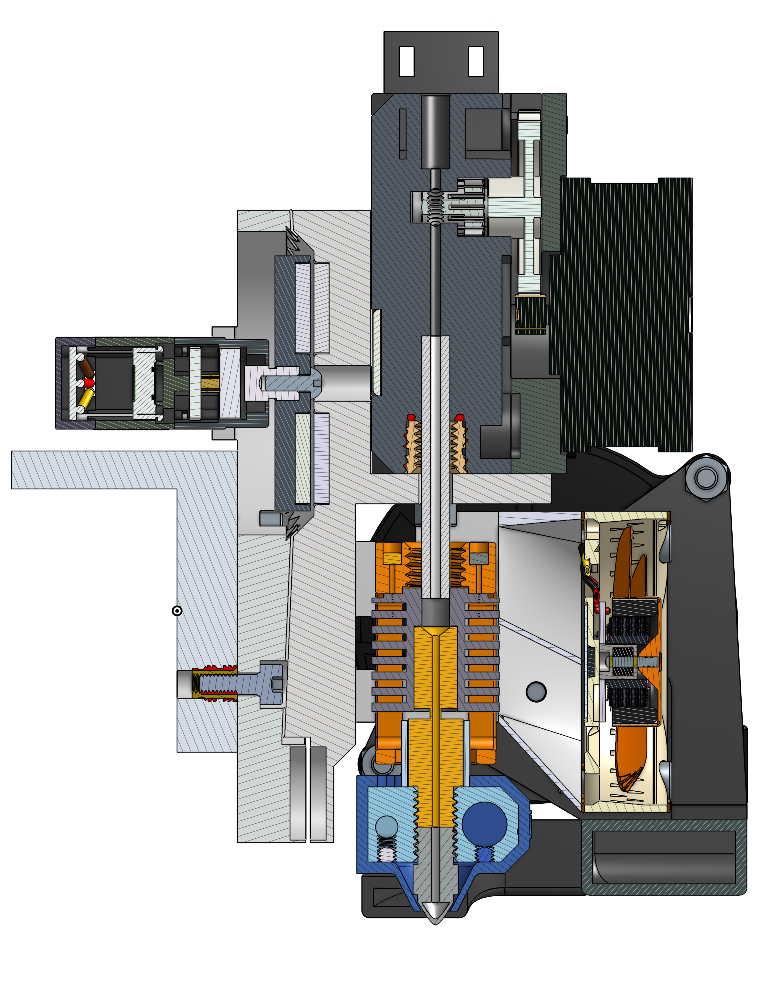
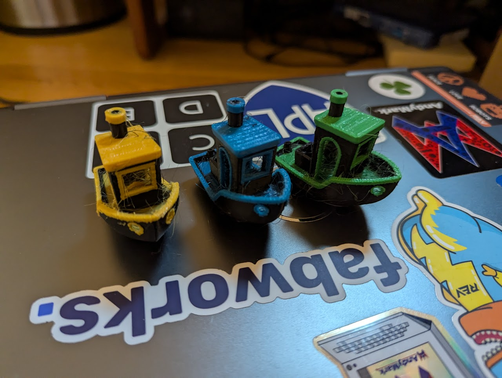

[Printer CAD](cad.onshape.com/documents/a5e473ce96770de6f7d85d0b/w/bd775ddb5e4d79728f467c52/e/3deef4354fbe6b5467a0b953), [Hotend CAD](cad.onshape.com/documents/46dc7545bde7914645d91a54/w/5611eb56c6c3defb5681386b/e/2065edcf0676d0bbf2a34f75)

In summer 2024, I decided to revisit one of my old projects, except now with the knowledge and experience needed to actually do it right. This, combined with the recent release of the [Prusa XL](https://www.prusa3d.com/product/original-prusa-xl-semi-assembled-single-toolhead-3d-printer/) and the [retirement of the E3D toolchanger](https://e3d-online.com/blogs/news/tc-discontinued) (you will forever be in our hearts) led me to try and design a toolchanging printer of my own.
## Design
### Kinematics
To start off, I used a fairly popular toolchanger design, featuring a CoreXY kinematic system and direct drive extruders. CoreXY meant that docked toolheads didn't need to move, and direct drive allowed for more straightforward and reliable filament paths.

For the Z axis, I went with a dual lead-screw design with MGN9H linear rails and blocks. This allowed for a smooth, robust, and precise movement.
### Toolchanging
The most difficult part of this projet was tool mounting design. One reason why DIY toolchangers are rare is that repeated mating cycles with the toolhead wears out the connection point. As such, for commercial printers, these parts usually need to be made of hardended steel, making it difficult for someone to make at home. In my design, I tackled this problem by using magnets to attach the toolhead. On both the carriage and the toolhead, magnets were mounted in a circle with alternating polarities. By rotating the magnets on the carriage 60 degrees, pairs of opposing magnets went from attracting each other to repelling each other, or vice versa. With this, the printer can control the attachment of the carriage without any moving parts in contact with each other. While making the printer, I tested many magnet sizes and patterns, eventually settling on 4 12mm neodymium magnets.



To prevent the toolhead and carraige from getting misaligned, I designed a radially symmetric "sun" pattern. This pattern tool advantage of the attracting force of the magnets to automatically align the toolhead and the carriage while minimizing space. 

### Electronics
A quirk of this printer is how many motors it uses. While most printers use 4 (XYZE), this printer uses 8 (2 for X/Y, 2 for Z, 1 for each of the 4 extruders). To handle this many motors, I used the BTT Octopus board, which supports up to 8 motors and 4 hotends. For control, I chose Klipper running on a Raspberry Pi 4 for its power and web interface.

## Gallery

