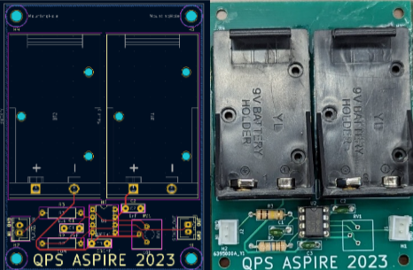



[Poster](https://drive.google.com/file/d/1893rlhJyZfj8MQBtIDyjyEeDnDJqSdX2/view), [Writeup](https://drive.google.com/file/d/1corAnmnPk63qLdvq_lZ_vqyk2y0kxLap/view)

In the summer of 2023, I took part in a JHU ASPIRE internship with the QPS group. My task was to design a D-dot sensor (a type of electric field sensor) to detect hidden powerlines throughout the building they were working in, as well as the parking lot outside. My mentor was Dr. Kevin Claytor.
## Theory
D-dot sensors are electric field sensors that detect changes in the electric displacement field (D-field, hence the name). It does this by having two electrodes - one "reference" electrode that acts as the sensor's ground, and another placed some distance away. When an electric field is placed between the plates, electrons flow from one electrode to the other, creating a current. The current generated by the applied electric field \\(|E|\sin(2\pi f t)\\) (where \\(|E|\\) is the magnitude of the E-field, and \\(f\\) is the frequency) at time \\(t\\) can be found from the following equation:
$$
I=2\pi f \varepsilon_r \varepsilon_0 A|E| \cos (2 \pi f t)
$$
Where \\(A\\) is the area of the electrodes, \\(\varepsilon_r\\) is the permittivity of the material between the electrodes, and \\(\varepsilon_0\\) is the permittivity of free space.[^1]

By feeding this current into a transimpedance amplifier, we are able to create a voltage from which we may take measurements.

## Design
### Amplifier circuit
To first convert a current into a voltage, I used a resistor placed between the plates of the capacitor. Because the area of the plates were fairly small, we could not expect much current from the plates. This could be solved using a large resistor - however, since the plates and resistor combined made an RC circuit, to preserve responsiveness, I wanted a fairly small time constant. Thus, the resistor cannot be too big (the end value I chose was \\(100 \text{ k}\Omega\\)). To convert this fairly small voltage drop across the plates to a large one we can plug into a DAQ, an inverting amplifier was used with a gain of \\(100 \frac{\text{V}}{\text{V}}\\). A low-pass filter was also implemented on the input side to reduce high-frequency noise.

Before building the circuit, we used LTSpice simulated its frequency response from a \\(120 \text{ V}\\) AC source ranging from \\(1 \text{ Hz}\\) to \\(200 \text{ Hz}\\). To simulate a high-impedance load, a \\(100 \text{ m}\Omega\\) resistor was placed on the output side From this, we were able to see that a \\(60 \text{ Hz}\\) input would result in an output voltage of about \\(0.9 \text{ V}\\).

### Electrodes
For the sensor, I chose to use 2"x2" and 6"x6" electrodes. The 2"x2" electrodes were held 1" apart, while the 6"x6" electrodes were held 1 cm apart.

## Testing
To test the sensor, I needed a known uniform electric field. For this, I prepared two 12"x12" sheets of aluminum held 2" apart by standoffs. These plates were connected to a function generator generating a sine wave at \\(10 \text{V}_\text{pp}\\). From that, we were able to see the frequency responses of the sensor with different plate sizes.

After confirmation that the circuit worked in the real world, I created PCBs for durability and reliability.

## Experimentation
### Power line sensing
For power line sensing, I worked with 2 other QPS interns to create a sensor suite featuring a 3 axis magnetometer and GPS. We put this suite in a cart ~1 foot off the ground, and walked over a known powerline. The results showed a clear increase in activity corresponding to where the powerline was located.

Over an unknown powerline, there was a noticable increase in activity consistent with a straight line under the parking lot. We believe that this is where a buried powerline is located.

### Presence detection
Another use case of these sensors was for human presence detection. By combining 4 sensors, were were able to use the human body's disturbance of the 60 Hz E-field generated by power lines to roughly tell direction.

[^1]: Z. D. Drummond, K. E. Claytor, R. N. Adelman, D. R. Allee and D. M. Hull, "Planar Near-Field Electric Field Sensor Array Applications Facilitated by Neural Networks," in IEEE Sensors Journal, vol. 21, no. 18, pp. 21038-21049, 15 Sept.15, 2021, doi: 10.1109/JSEN.2021.3099984.