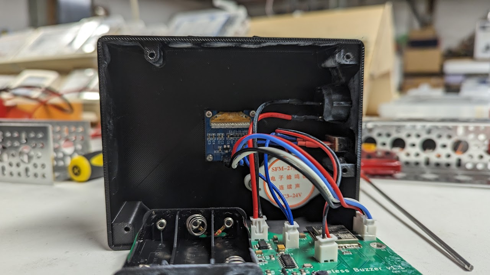

[Github](https://github.com/Epicotch/Wireless-Buzzers), [CAD](https://cad.onshape.com/documents/be3b52bcdf6f61d23120cde6/w/8980feb9664c58ae24ebe7fa/e/2e3678f5986a811a7a830685)

In high school, I helped coach a local middle school Science Bowl team. Unfortunately, their buzzers from last year no longer worked, and no commercial buzzer system could support their amount of simultaneous players and space requirements. Furthermore, due to the school's ban on personal devices, having them buzz via a website wasn't an option either. Furthermore, I was interesting in learning PCB design, and was looking for a project to implement it. As such, I took it upon myself to build them a set of wireless buzzers for practice.
## Design
When designing these, I had two main goals in mind - longevity and ease of use. For longevity, I tried to use off-the-shelf components as much as possible - namely, since the cords were most likely to break, I used standard 3.5mm audio cables to connect the plungers to the buzzer box. Furthermore, any console could be used as the master console, allowing for easy replacements in case one broke.

For ease of use, I wanted to minimize the interactions the students had to go through to get the game ready. As such, I designed my own auto-pairing protocol based off of ESP-NOW, which would search for a master console and automatically pair to it if it were available. As such, all the students would have to do is turn the buzzers on, and they would be ready to play. Below is a simplified explanation of the protocol:





Upon connecting, each buzzer is also given a unique idenfitication number, so the proctor can tell who buzzed.

In order to be able to easily tell who buzzed, I put an OLED screen on the box, as well as the loudest buzzer I could find (that the board could power). The OLED screen would display the letter and the number of the buzzer according to the Science Bowl format, allowing the proctor to easily see who buzzed.



Finally, I implemented a lockout system preventing others from buzzing after the first person buzzed. Buzzes could be cleared by pressing the buzzer connected to the first buzzer slot of the master console.
## In use
The first few times I brought the buzzers to club, there were still a few issues to iron out. Specifically, the master console could not handle simultanous buzzes (and just crashed), and disconnections would result in everyone needing to reset all their buzzers. However, after solving these issues, we were able to use these buzzers for practice for the rest of the year.

## Gallery


