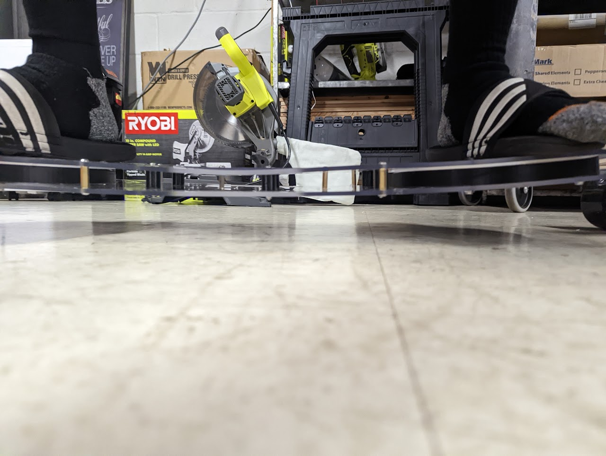
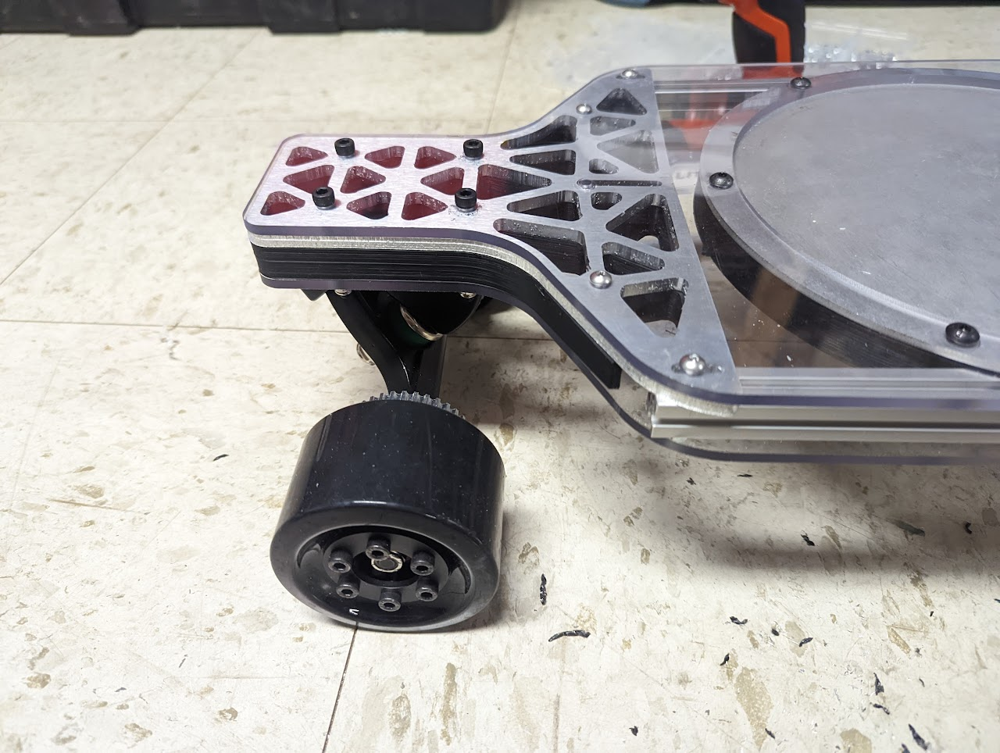
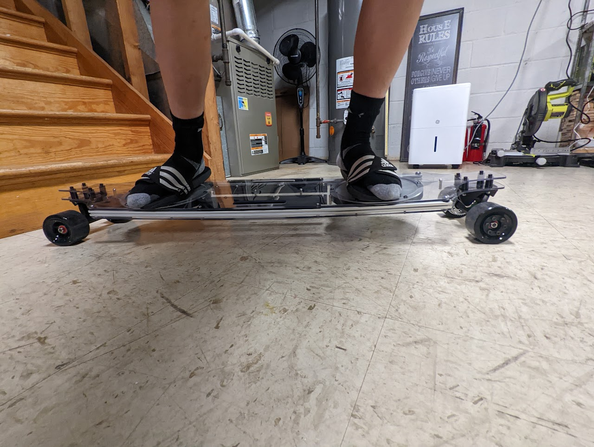
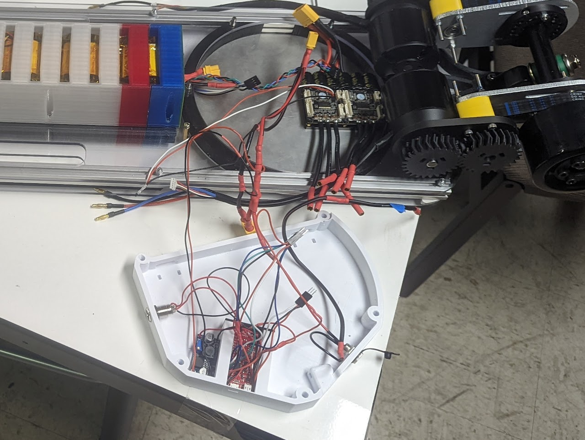
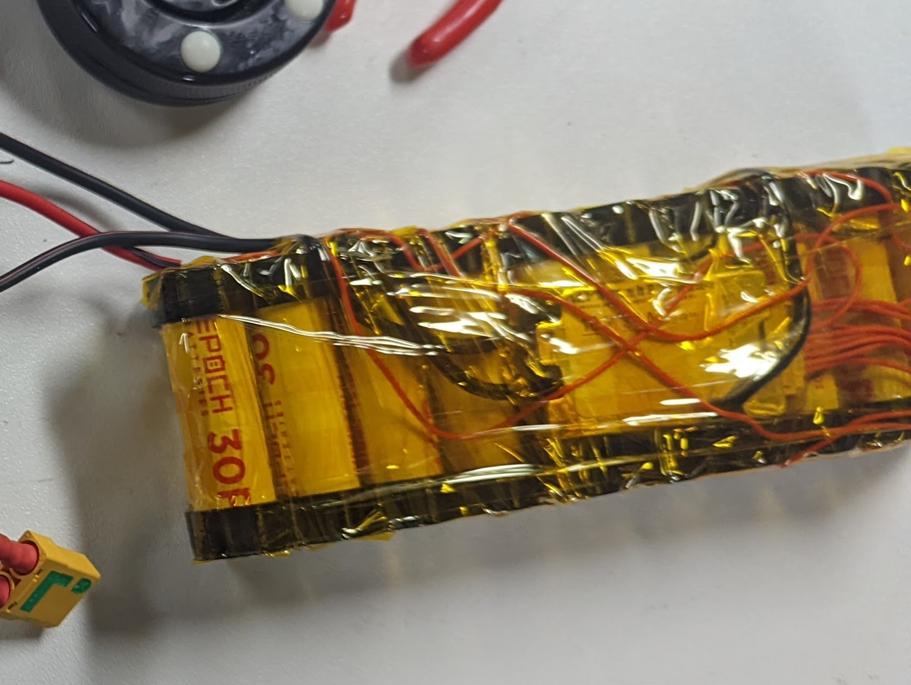
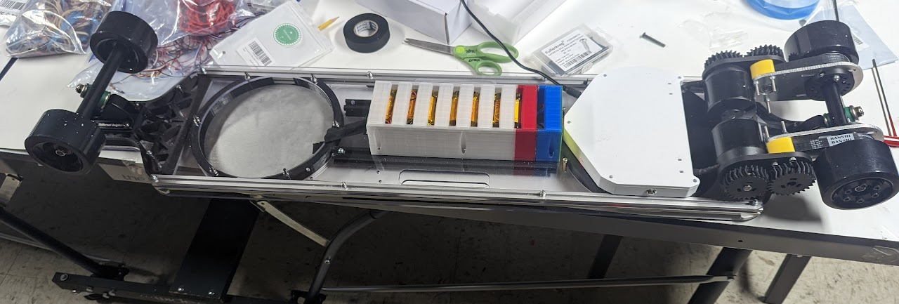
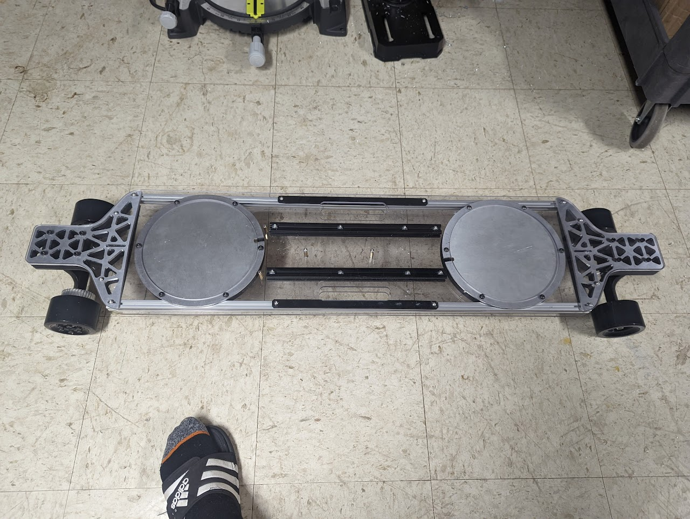
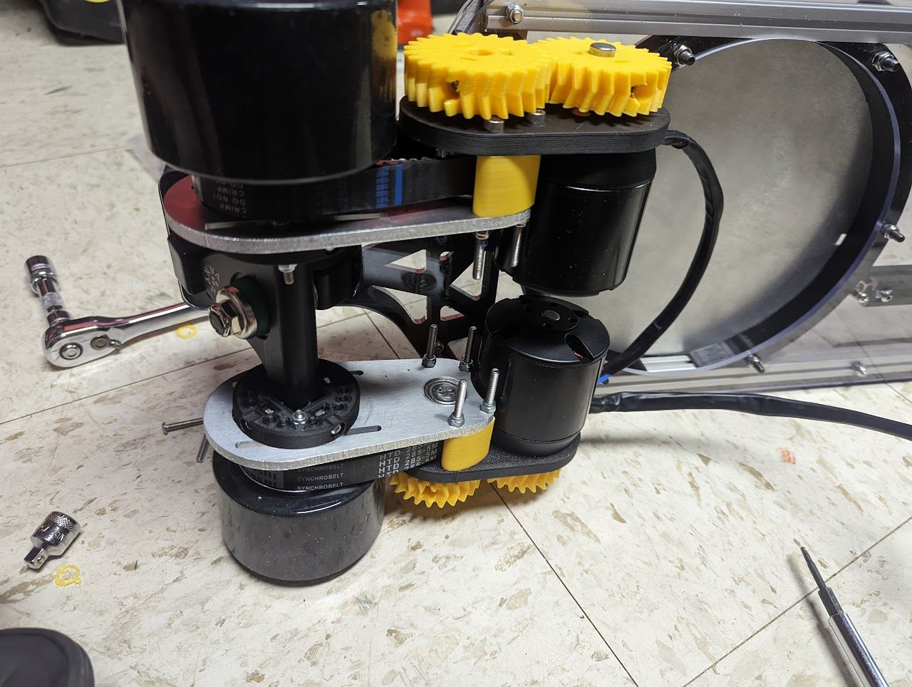

Skateboards are cool! Electric skateboards even more so. Just one small issue - there's this darn remote that you have to keep track of all the time! What if we could make a skateboard that doesn't need an independent remote to control speed? This (combined with the fact that I wanted to stop having to walk to school at 7 AM) led me to design an electric skateboard with a novel weight-based control.
## Design
The entire design of the skateboard centers around the control scheme. Instead of having a remote, there is a load cell positioned under each foot, and the weight difference between the load cells would determine your acceleration (i.e. more weight on front = accelerate forward, more weight on back = accelerate backwards). Furthermore, if no weight is detected, stop both motors. 
### The board
This meant that I also had to design my own board. My first design consisted of 2 sheets of 1/4" polycarbonate spaced apart with standoffs. However, this was nowhere near stiff enough, as can be seen below:

To stiffen it, I added multiple pieces of aluminum extrusion running across the length of the board, as well as 3D printed and CNC machined endplates to make sure the trucks don't bend the ends too much. These modifications were able to bring the bend down to a reasonable level.

### Electronics
To control the board, I used a Sparkfun ESP32 Thing board, which allowed for backup Bluetooth connectivity in case the weight-based control scheme didn't pan out. I also used two 170KV BLDC motors belted at a 2:1 ratio to each of the front wheels, and a FLIPSKY dual VESC to control and power the motors.

By far the scariest part of the project was making the battery. I decided to use 3000 mAh 3.6V 18650 batteries in a 10S2P layout (10 in series, 2 in parallel), resulting in an estimated range of 11 km (or 6.8 mi). Using nickel strips and a custom 3D printed jig, I spot welded the batteries together and secured it to the underside of the skateboard.




## Performance
The control system worked on flat ground. On slopes, however, the board was very hard to control, as I subconsciously put more weight on the downward-facing foot, resulting in further downward acceleration.
## Gallery


