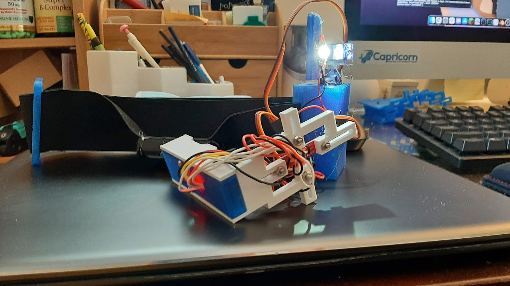
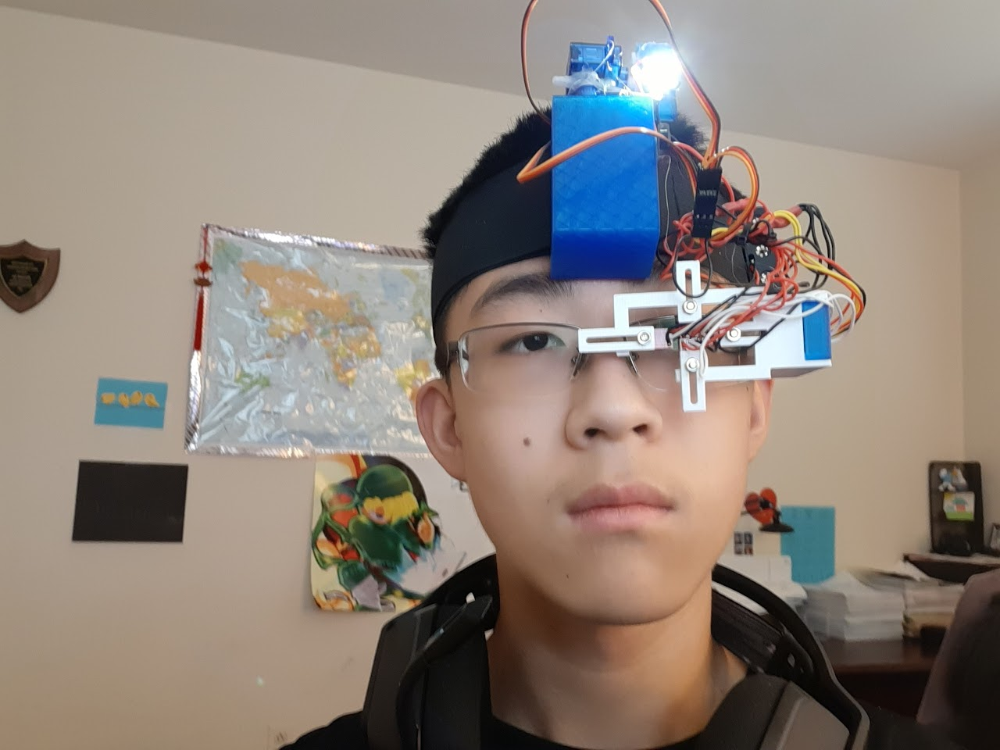
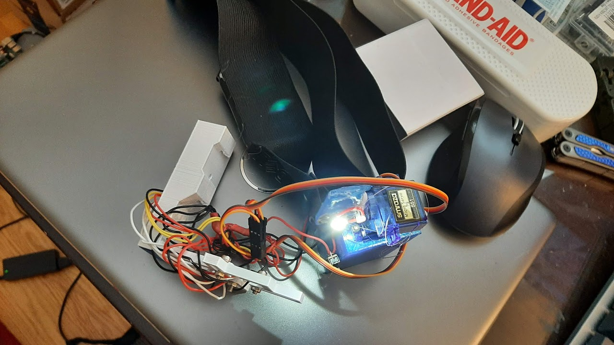

This was a project I quickly put together for the Inventing merit badge. It uses four reflectivity sensors and two micro servos to achieve limited directional control based on the position of the eye. For ease of use, it clipped onto my glasses.
## Gallery


