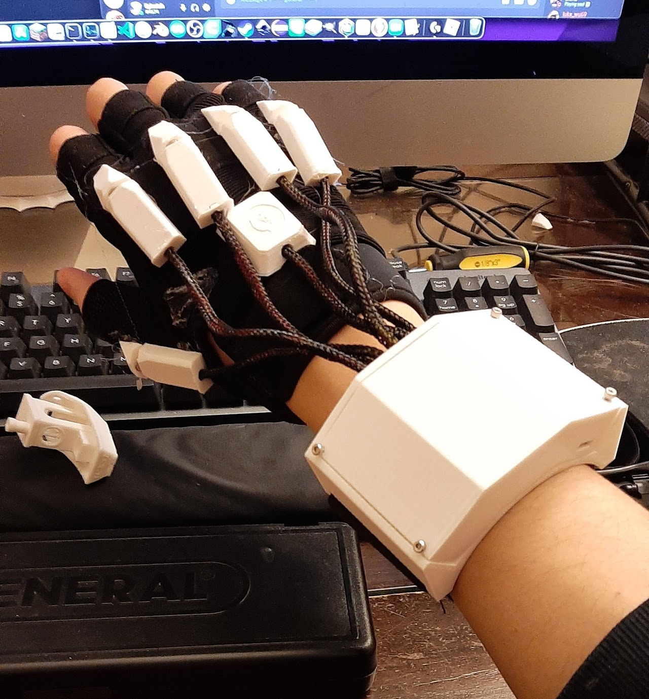
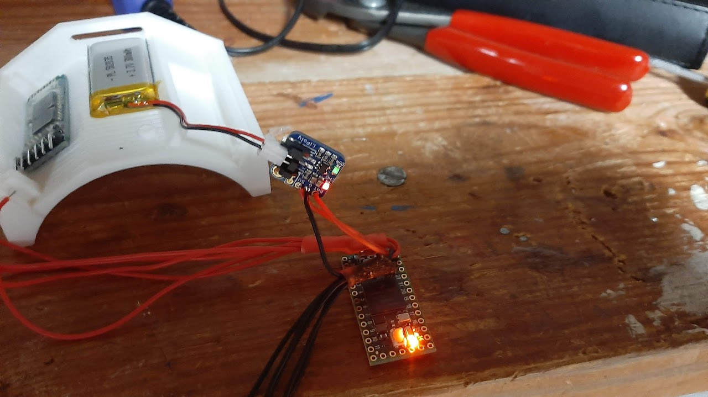

After seeing [Zack Freedman's video](https://www.youtube.com/watch?v=6raRftH9yxM) on his Somatic data glove, I wanted to make my own version. Furthermore, I was highly interested in learning how to use electronics and looking for a project idea. So, I decided to build my very own data glove.
## Design
### Glove
To detect finger position, I used hall effect sensors and small 6mm neodymium magnets. The sensors were mounted on the base of my knuckles and the magnets on my fingers, and were positioned in such a way where when I extended my fingers, the magnet would be close enough to the sensor to trigger it. On the center of the back of my hand was also a 6 DOF MPU6050 IMU, which I used to detect hand velocity and orientation.
### Wrist box
The wrist box held a Teensy 4.0, the battery, battery charger, and an HC-05 Bluetooth module. These were all mounted on a (roughly) semicircular bracelet, with wires running to each hall effect sensor and the IMU.

Unfortunately, the HC-05 does not support acting as a HID (human interface device) by default. However, it shared a controller with the RN-42 bluetooth module, which does support HID. By using an FTDI and reflashing it, I was able to enable HID on the HC-05.
### Software
The glove was programmed using Arduino based C. By integrating the angular acceleration measurements twice, I was able to get angular position. From this, I translated the angle of the hand to relative position across the screen (90 degrees meant across the screen), and configured the HC-05 to behave as a bluetooth mouse. Curling the index and middle fingers were tied to left and right clicking respectively, and curling both was tied to middle click.
## Gallery




