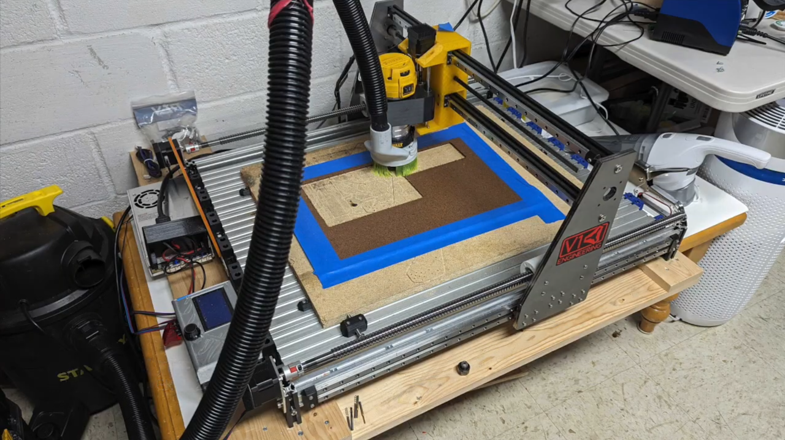
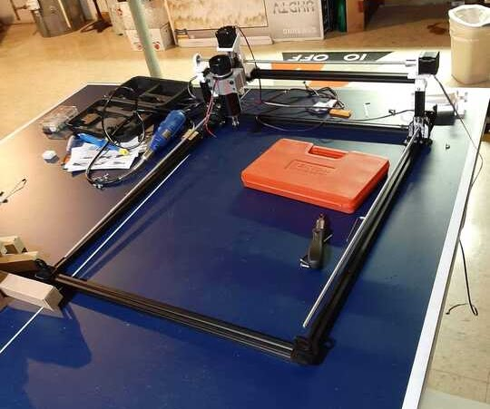
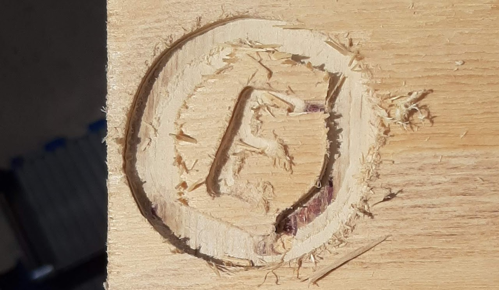
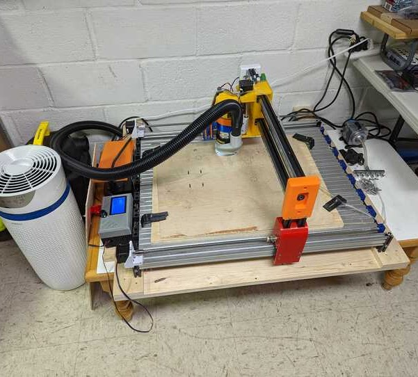
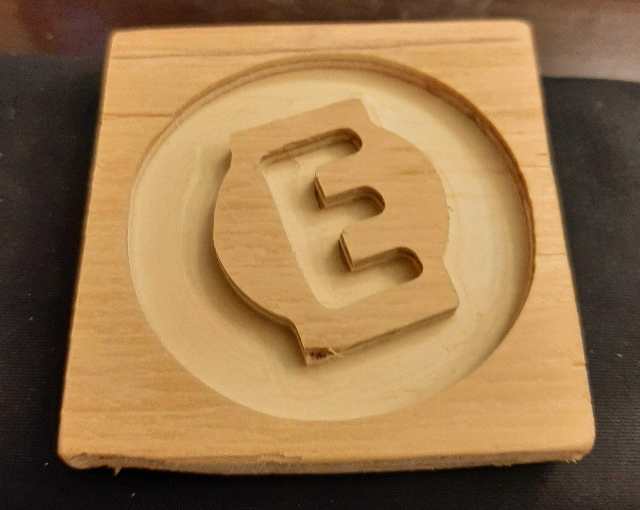
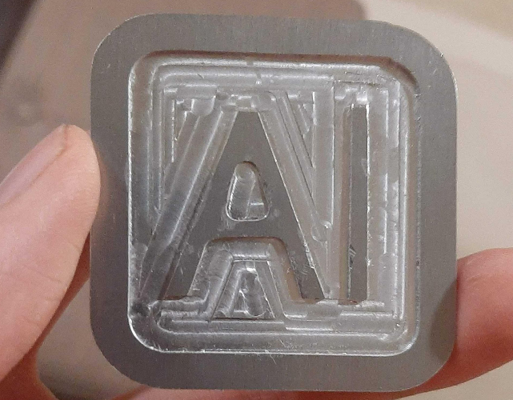
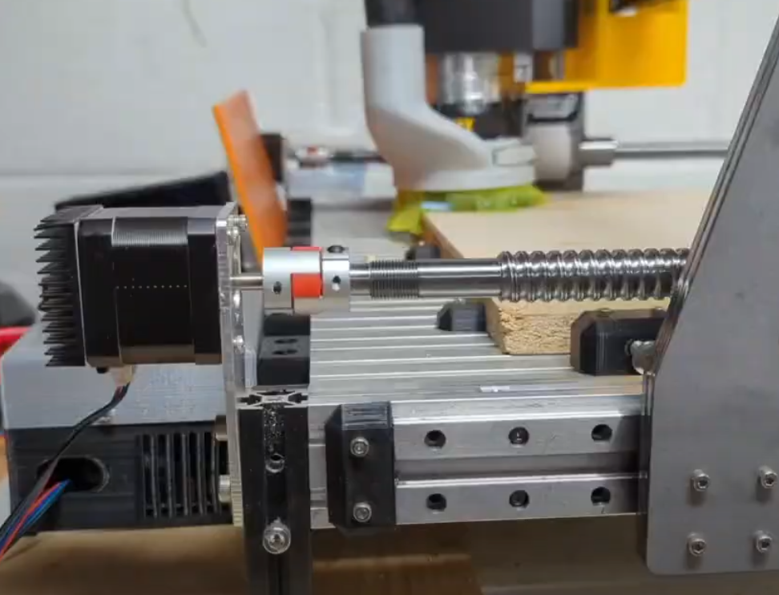
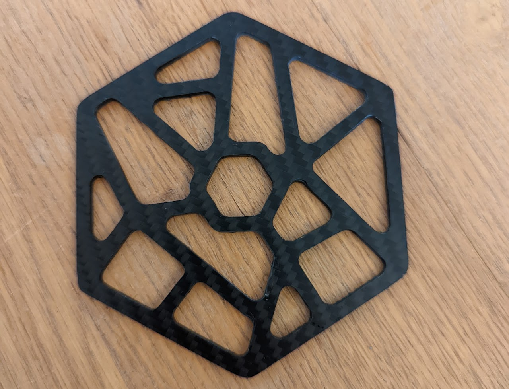
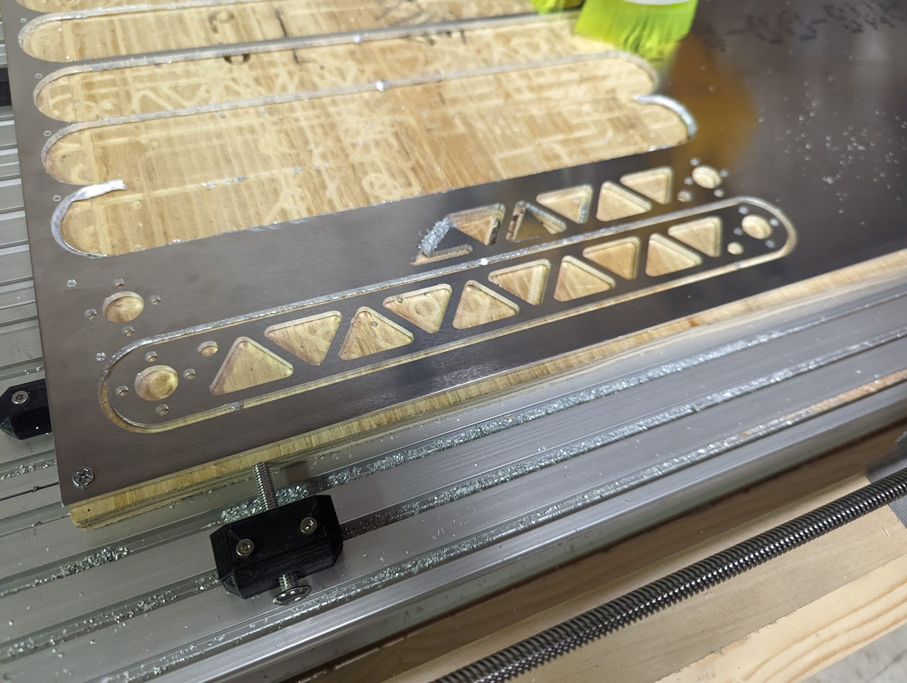
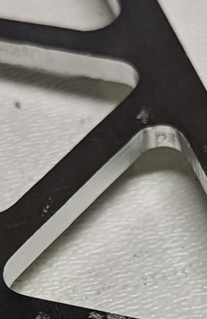

[V1 and V2 CAD](https://cad.onshape.com/documents/95fcb178b80c65dbbc1ee400/w/d05f93ca7a4e031817c5436f/e/f2989c41ccec56b765d5f432), [Y plate CAD](https://cad.onshape.com/documents/37da91f2170d8fc2f1bdcc3a/w/48488ea1e6c325fea867aeea/e/4429af80fef63bd4f1129240), [Z carriage](https://cad.onshape.com/documents/739f64a722e4aa1b82296dc4/w/785dd05a5acceb8fcf86c5d3/e/b3c57ec28e8996d5c6ae1b2f)

One of the big issues I encountered when building my 3D printer was manufacturing the frame. It was difficult manhandling the jigsaw to cut precisely where I wanted, and the drill holes never exactly lined up. Furthermore, as plate manufacturing is such a large thing in FTC, I wanted to be able to mull 1/8" 6061 T6 aluminum in house. As such, I set my sights on building a CNC machine. This machine was initially built in 2020, with improvements made in 2021 and 2022.
## V1 (2020)
### Design
At first, I had nearly no idea what I was doing. Taking inspiration from commercial designs and 3D printers, I used NEMA 17 stepper motors and V-slot extrusion with plastic wheels. While this was able to move precisely and smoothly, when cutting, the large frame and flimsy construction resulted in imprecise and unrepeatable cuts.

As this machine was to be working indoors, I also designed a dust shoe to collect chips and dust that were created by the end mill. This dust shoe was connected to a shop vaccum to provide a large suction force.

Though the machine was no good, this experience taught me a lot - how to work with aluminum extrusion, the basics of frame design and statics, and how to use a CNC machine.
### Gallery




## V2 (2021)
### Design
Learning from the first design, I drastically stiffened the frame (larger extrusions, linear bearings, aluminum extrusions for corners, bulkier 3D prints). I also upgraded the spindle from a cheap rotary tool to a Dewalt mini-router, finally giving the machine the horsepower it needed to be able to cut through aluminum.

Though this machine was a big improvement, it still had quite a few issues. The Y carriages were still mostly 3D printed, which resulted in a lot of flex along the Y axis. Furthermore, the small bearings used for linear bushings were prone to breaking, expecially under high vibration environments. Finally, resonance generated by the cutting tool led to consistent imperfections in the cutting face.
### A brief foray into lasers
You may notice a small blue-and-orange thing hanging off the end of the spindle. In this iteration, I also tried to integrate a diode laser into the machine. The idea was to integrate laser etching (and possibly cutting) into the workflow of this machine, letting me make CNC cut parts that also had perfectly positioned laser features. While the laser did work (shockingly well), I found it unnecessary as I mostly did fast prototyping on this machine, and took it off in v3.

### Gallery



## V3 (2022)
### Design
To further stiffen the machine, I replaced the 3D printed Y-carriages with 1/4" mild steel plates. The added weight resulted in the Y-axis leadscrews binding - as such, they were replaced with ball screws, which provide more precise and smoother motion.

Part mounting was also an issue with the previous two versions, as the simple clamping mount caused parts to slip. This was replaced by side gripping mounts which hold onto the spoilboard, and wood screws to hold the part being cut securely onto the spoilboard.

This design was able to precisely cut aluminum, as well as more exotic materials such as carbon fiber and G10.
### Gallery


