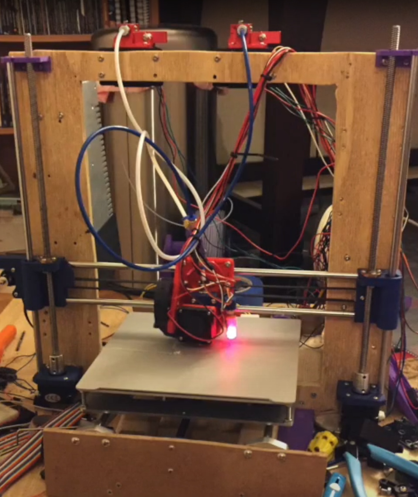

Say hello to my very first project! I built this thing because I was VERY into 3D printers, and started getting bored of my stock Ender 3. In particular, I wanted to try out multi-color printing. When I built this, I had no idea what tolerances, precision, or frame stiffness even was - I just wanted to get my hands moving and build something awesome. Of course, knowing next to nothing about engineering, I built this floppy and imprecise fire hazard. While it did print (in that it indeed melted plastic and put it vaguely in the shape I wanted it to), the dual-extrusion part turned out to be a flop. Nevertheless, I still hold great respect for this could-have-been great machine, as it kicked off a making streak that continues to this day.