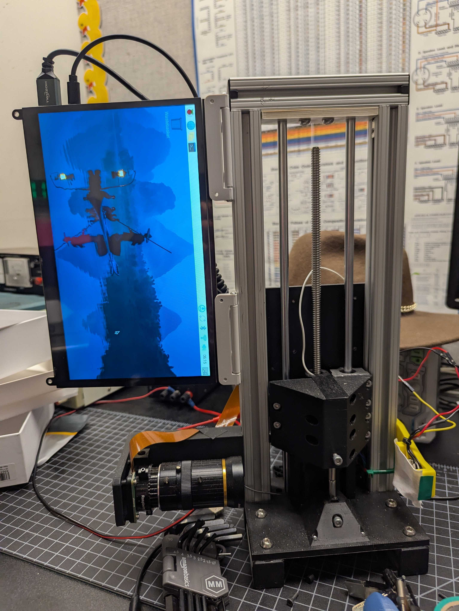
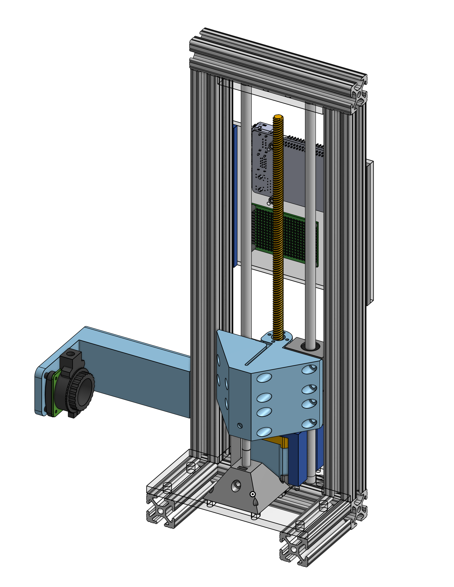

As part of my undergraduate research at the Fluids and Health Network (FHN) at MIT, I am building an extensional rheometer, which uses capillary breakup to measure the extensional viscosity of a fluid.
## Background
Extentional rheometry is useful in measuring polymers and other materials for use in the fluids research conducted by the FHN. The premise is simple: by stretching a sample into a thin filament with nearly constant diameter, we can measure the diameter of the filament over time to find the extensional viscosity of the sample.

So far, there is only one commercially successful extensional rheometer - the [Thermo-Scientific HAAKE CaBER](https://www.rheologysolutions.com/thermo-scientific-haake-caber-1/). However, the CaBER is very heavy, restricting its use to labs and prevent it from being brought on the field to help with measurements. The FHN seeks to change this with the development of a portable extensional rheometer.
## Design
### Hardware
The kinematics for this device are a leadscrew driven linear actuator, supported by 1010 extrusion and 8mm linear rods.

One of the main goals for this project is onboard processing. As such, a Raspberry Pi 5 4GB was chosen as the controller. The Pi is connected to a TMC2209 motor driver, which controls the stepper motor, as well as a Raspberry Pi Global Shutter camera attached to a varifocal lens focused on the sample. Opposed to the lens is a neopixel ring, which provides lighting to the sample and allows the rheometer to easily discern the edges of the sample.

Two 6mm steel dowels (henceforth referred to as "plates") are placed opposite each other, with the lower one grounded and the upper one attached to the Pi's GPIO, as well as tied to 3.3V using a 1 megaohm pullup resistor. This allows the Pi's GPIO to be pulled to ground when the sample is connected between the plates, and pulled high when it disconnects.
### Software
The rheometer is programmed using Python 3.11 on the Raspberry Pi. I used [PyTmcStepper](https://github.com/Chr157i4n/PyTmcStepper) to control the TMC2209, and [gpiozero](https://gpiozero.readthedocs.io/en/latest/) to control the neopixel, as well as detect the breakup of the sample.

In order to recieve accurate data, a high framerate is important. The Pi's global shutter camera is an inexpensive way to achieve this, as by cropping the image, we can reach framerates of 580 FPS. This is achieved by using `media-ctl`, a built-in Linux tool for managing cameras. Finally, the edges of the sample are found using canny edge detection, allowing for easy-to-process frames.

Currently, the only way to control the rheometer is through SSH. To make it more user-friendly, I am currently working in creating a GUI-based application which, when combined with the attached touchscreen, should make the device much more user-friendly.
## Gallery
Left: fluid sample captured by camera. Right: edge detected version


