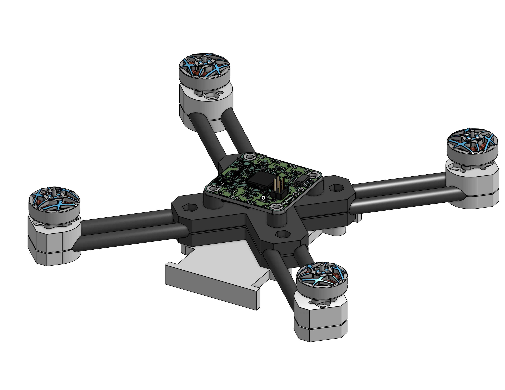
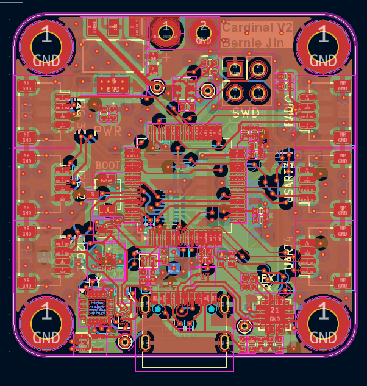
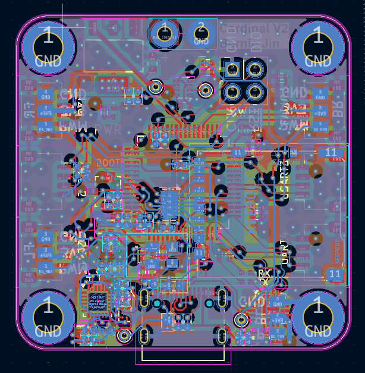

[Github](https://github.com/Epicotch/Epic-Drone), [CAD](https://cad.onshape.com/documents/60a38a968a7095625ac4a5dd/w/3d45a0af2e3ee89a2ddb7d66/e/9b0f4a39a1b3047c8f79d75b)

Having used Arduinos for a while, I wanted to move to something bigger and more industry-standard. As such, the natural next step would be to STMicroelectronics' STM32 chips. After playing around with a Nucleo board for a while, I decided to combine my interest in learning about STM32s with my interest in robotics and create an autonomous drone.
## Design
### Electronics
The core of the drone is the Cardinal - a small 30mm x 30mm STM32H562RIT6 based board I designed for this project. For localization and kinematics, I also included a built-in ICM20948 IMU, as well as a BMP390 barometer for altitude measurement. The board has a 2KB EEPROM to store tunable data (such as PID values), as well as a microSD card slot for logging (and hopefully programming in the future). Finally, the board has a USB-C connector with a CP2102N USB to UART bridge, allowing for debugging and programming via USB. On the edges of the board are connectors for various peripherals in case I want to expand upon this board in the future.

For communication, I plan to use an Xbee RR Zigbee module due to its range and minimal interface. This will be connected to a dedicated UART port labeled "RADIO".
### Hardware
As this is my first time making a drone, I decided to use 4" propellers for safety. To be strong yet light, I'm using 4 6mm carbon fiber tubes arranged in an "X" pattern. These tubes have notches carved into them to allow them to overlap in the middle, and are held together by clamps that also act as electronics mounts.

In order to make the frame portable, everything is held together by M3 screws. As such, when not in use, it can be easily disassembled to not take up too much space in my dorm room.
### Software
Besides just learning how to design a board for STM32, this project is also a deep dive into low-level electronics. My plans for this project are to write everything from the ground up (exclusing what's already available in STM32's HAL). As such, I am currently writing my own ICM20948 driver, and plan to write drivers for the other I2C devices on the board as well.
## Gallery
PCB Layout for top and bottom side of Cardinal.


