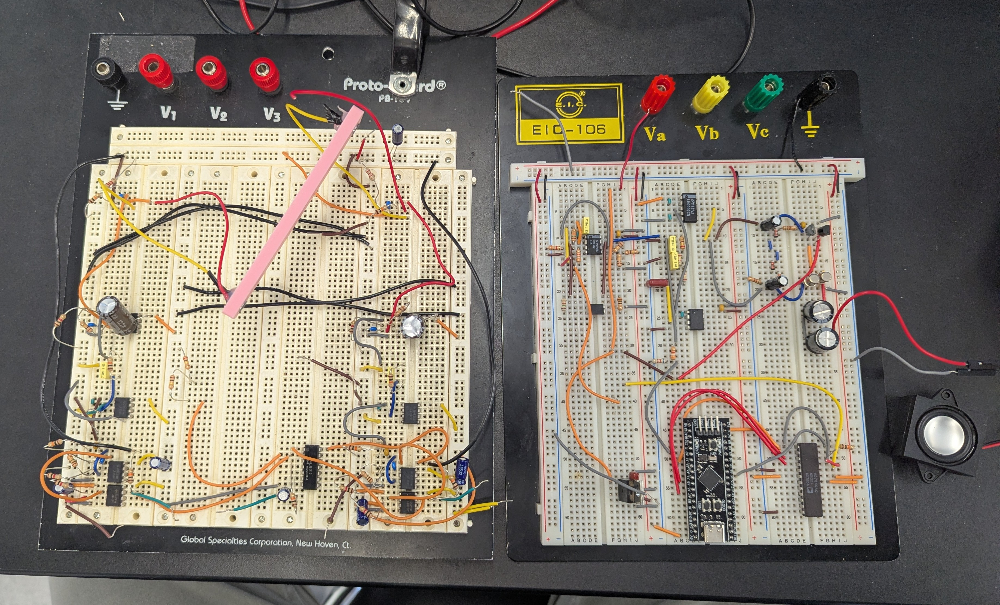
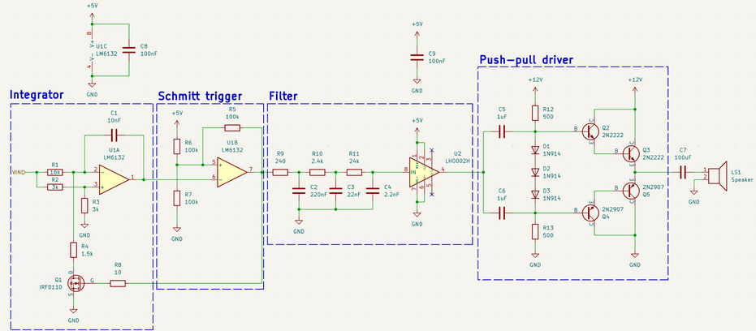
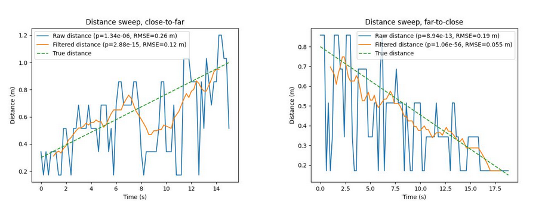


Writeup


For my 6.2040 (Analog Lab) final project, I worked together with a classmate to create an FMCW sonar system. This project proved to be an interesting and highly educational combination of analog electronics and digital signal processing (DSP). I worked on the transmit (TX) stage and the DSP, and my partner worked on the recieving (RX) stage.

For the TX stage, I built a voltage-controlled oscillator (VCO), and filtered the output to create a sine-wave. A push-pull output was then used to drive a speaker.

For the DSP and overall system control, I used an STM32 Black Pill development board. This helped me get familiarity with the STM32 and overall ARM CMSIS platforms, and allowed for easy tuning of the FMCW sweep and signal processing parameters.

The final device was able to locate a target to a range accuracy of 5.5 cm.

