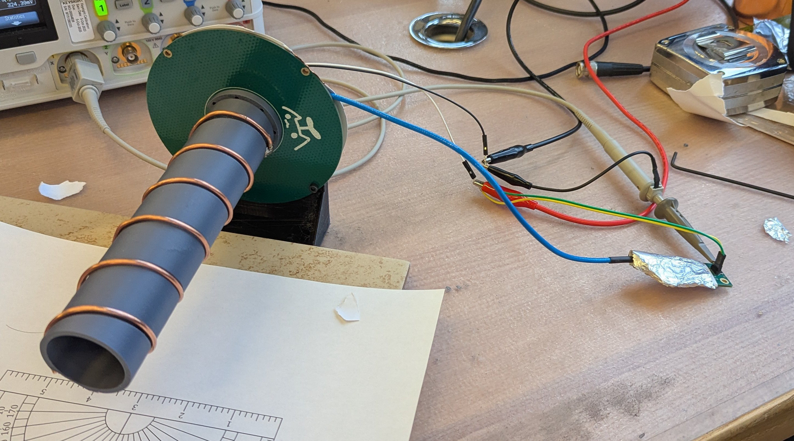




Writeup


GitHub


For my 6.2300 (EM Waves and Applications) final project, I worked together with two of my classmates to create a 2.4 GHz radiation detector. I was personally responsible for designing the antenna, band-pass filter, and envelope detector.

For the antenna, I chose a helical antenna operating in axial mode for an easy-to-construct, high-directivity antenna. The antenna was simulated in Ansys HFSS and tuned with a network analyzer to achieve optimal performance at 2.4 GHz. A 3D printed support was added for structural stability and to keep spacing consistent, and a triangular strip of copper was added and trimmed at the base of the antenna to provide impedance matching with the amplifier.


  
  


For the bandpass filter, I chose a Chebyshev hairpin microstrip filter for its small footprint and steep rolloff. The filter was designed to have a center frequency of 2.4 GHz and a bandwidth of 100 MHz to cover the entire WiFi band. The filter was designed and tuned in Ansys HFSS and implemented on a custom PCB.


  
  


The envelope detector is a simple half-wave rectifier with an emitter-follower buffering the output. A time constant of \\(\\tau = 1 \\, \\text{ms}\\) was chosen to prevent 2.4 GHz ripple and other effects from WiFi itself from showing up, providing a steady analog voltage representing the output power.

The final device was able to detect a cell phone's hotspot from 5 feet away with a theoretical maximum of 50 feet. The output signal shows a clear step where WiFi signals are detected.


  
  
  
