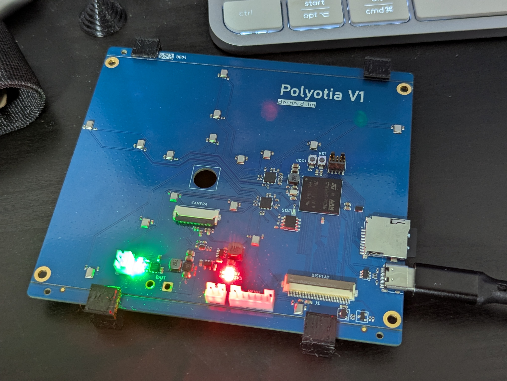
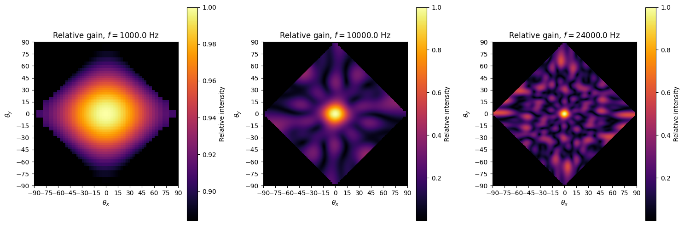




Github


After taking a waves and signal processing class, I wanted to apply what I've learned to the real world. My technical interests intersected with my hobby birding, which led me to make an acoustic camera primarily to find from where a bird call comes from.

## Microphones
The core of the acoustic camera is the microphone array. In order to achieve accurate beamforming at a certain frequency, the microphones should be at most \\(\\frac{\\lambda}{2}\\)$ apart to avoid grating lobes, but also be as far as possible to achieve high directionality. As such, to capture a wide range of frequencies, the spacing between the microphones needs to vary significantly as well. The camera achieves this by placing the microphones in a logarithmic spiral, allowing for a cluster of microphones in the middle to recieve high frequencies while having microphones at the edges be spaced out, achieving a large aperture and being able to capture lower frequencies. This array has a spacing ranging from **9.92mm** to **117.3mm**, leading to a clean resolution range of **17.15 kHz** to **2.92 kHz**. Furthermore, due to not being a regular pattern, the grating lobes will gradually appear, allowing it to resolve frequencies above its limits with reduced accuracy.

Before implementing this pattern in hardware, I wrote a python program to model the gain pattern of the array to confirm its performance and do any tweaks as necessary.

Because of the number of microphones, I decided to go with MEMS PDM microphones for their small size and cost. These microphones are connected to two daisy-chained audio ADCs, which communicate with the STM32 through time-domain multiplexing (TDM).

## Software/Firmware
To steer the array towards a particular direction, the camera calculates the time delay a signal from that direction would have on each microphone, and shifts each microphone's input signal the opposite way to have it "arrive" at all the microphones at once and constructively interfere when all signals are summed together. A signal from a different direction would appear to arrive at the microphones more or less at random, thus cancelling out when the signals are summed together.

While this could be achieved by delaying the time-domain signals in software, a different shift would need to be applied per pixel per microphone individually, resulting in a massive memory and computational load. Instead, we can take advantage of the [time-shift property](https://www.tutorialspoint.com/signals_and_systems/time_shifting_property_of_fourier_transform.htm) of Fourier transforms to efficiently calculate power based on time-shifting by only calculating the FFT of each signal once, and then applying a multiplicative offset on each term in-place to achieve the same result. Furthermore, doing this allows us to see the frequency spectrum recieved from each direction, and allows for fractional-sample shifts, thus placing the pixels more precisely. A 1024-point FFT and a sample rate of 48 kHz sample rate was chosen to give a frequency resolution of **~47 Hz**.

The STM32H747 was chosen as the MCU for its dual-core design. The microphone and beamforming logic is handled by the more performant M7 core, while logging and communication are handled by the M4 core. This setup allowed for a refresh rate of **6.2 Hz** for a 20x20 pixel grid. Messages are passed between the cores using HSEMs and OpenAMP.



## Next steps
My goal for this project is to make it a portable all-in-once device that can be taken out to the field to track down birds. The PCB already has the hardware to support a camera and display, though hardware bugs prevent them from being implemented at this moment. Battery hardware is also included, though I didn't have the tools to safely implement a battery.

I would also like to add more microphones for better directionality and a wider frequency range. While the ADCs I used do support up t 32 microphones, processing all this on an STM32 would result in an extremely slow refresh rate. As such, an FPGA microphone frontend would also be a nice touch, being able to accept more microphones and do faster signal processing all at once. A lower-performance MCU could then be used to handle the rest of the display/logging/storage logic.

Finally, there is still a non-negligible amount of aliasing present due to the grating lobes caused by the microphones spread far apart. I plan to implement a filter to reduce the contributions of the further-out microphones based on frequency, hopefully reducing aliasing.
## What I learned
This project taught me a lot about arrays of sensors, particularly how they can be analyzed using Fourier methods. I also learned a lot about implementing signal processing in memory and computation-constrained environments, and how to optimize such algorithms using methods such as lookup tables and approximation.